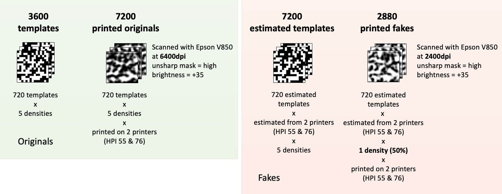

## Indigo 1x1 base
Public dataset of copy detection patterns (CDP) based on DataMatrix modulation [**Download**](https://sipcloud.unige.ch/index.php/s/TBzWKaCS77tcYPa)

## Usage
Indigo 1x1 base data set is not for any commercial usage, distribution or reproduction. It is solely for academic usage. The authors do no make any warranty or assume any legal liability or responsibility for the accuracy, completeness, or usefulness of any information (either isolated or in the aggregate) contained, or represent that its use would not infringe privately owned rights.

## Description
- Symbol size: **1x1**
- Printed on:
	- HP Indigo 5500 (HPI 55), prints at **812.8**dpi
    - HP Indigo 7600 (HPI 76), prints at **812.8**dpi
- Acquired by:
	- Epson Perfection V850 Pro
	- at 2400/6400dpi, 16bit grayscale
	- unsharp mask: **High**, brightness: **+35**

## Data amount

## CDP examples

<table style="width: 50%; margin: 0px auto; border: none">
<tbody>
<tr>
<th style="padding: 0; margin: 0;">

Digital template 

</th> <th style="padding: 0; margin: 0;">

Original HPI 55

</th> <th style="padding: 0; margin: 0;">

Original HPI 76 

</th>
</tr>
<tr>
<td>

</td>
<td>

</td>
<td>

</td>
</tr>
<tr>
<th style="padding: 0; margin: 0;">

 

</th> <th style="padding: 0; margin: 0;">

Fake 55 / 55 

</th> <th style="padding: 0; margin: 0;">

Fake 55 / 76 

</th>
</tr>
<tr>
<td>

&nbsp;

</td>
<td>

</td>
<td>

</td>
</tr>
<tr>
<th style="padding: 0; margin: 0;">

 

</th> <th style="padding: 0; margin: 0;">

Fake 76 / 55 

</th> <th style="padding: 0; margin: 0;">

Fake 76 / 76 

</th>
</tr>
<tr>
<td>

&nbsp;

</td>
<td>

</td>
<td>

</td>
</tr>
</tbody>
</table>

<table style="width: 50%; margin: 0px auto; border: none">
<tbody>
<tr>
<th style="padding: 0; margin: 0;">

30%

</th> <th>&nbsp;</th> <th style="padding: 0; margin: 0;">

35%

</th> <th>&nbsp;</th> <th style="padding: 0; margin: 0;">

40%

</th> <th>&nbsp;</th> <th style="padding: 0; margin: 0;">

45%

</th> <th>&nbsp;</th> <th style="padding: 0; margin: 0;">

50%

</th>
</tr>
<tr>
<td style="padding: 0; margin: 0;"></td>
<td>&nbsp;</td>
<td style="padding: 0; margin: 0;"></td>
<td>&nbsp;</td>
<td style="padding: 0; margin: 0;"></td>
<td>&nbsp;</td>
<td style="padding: 0; margin: 0;"></td>
<td>&nbsp;</td>
<td style="padding: 0; margin: 0;"></td>
</tr>
</tbody>
</table>

## Citation

    @inproceedings { Chaban2021wifs,
        author = { Chaban, Roman and Taran, Olga and Tutt, Joakim and Holotyak, Taras and Bonev, Slavi and Voloshynovskiy, Slava },
        booktitle = { IEEE International Workshop on Information Forensics and Security (WIFS)},
        title = { Machine learning attack on copy detection patterns: are 1x1 patterns cloneable? },
        address = { Montpellier, France },
        month = { December },
        year = { 2021 }
    }
